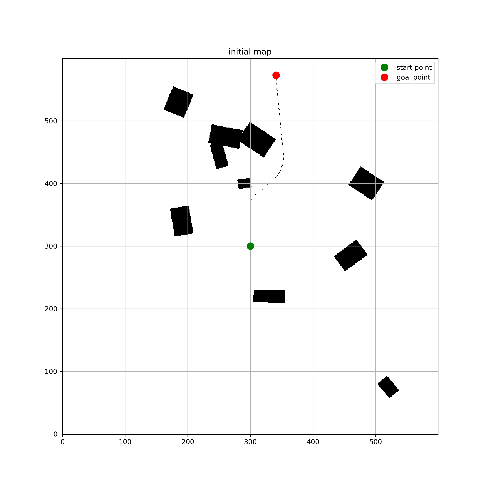
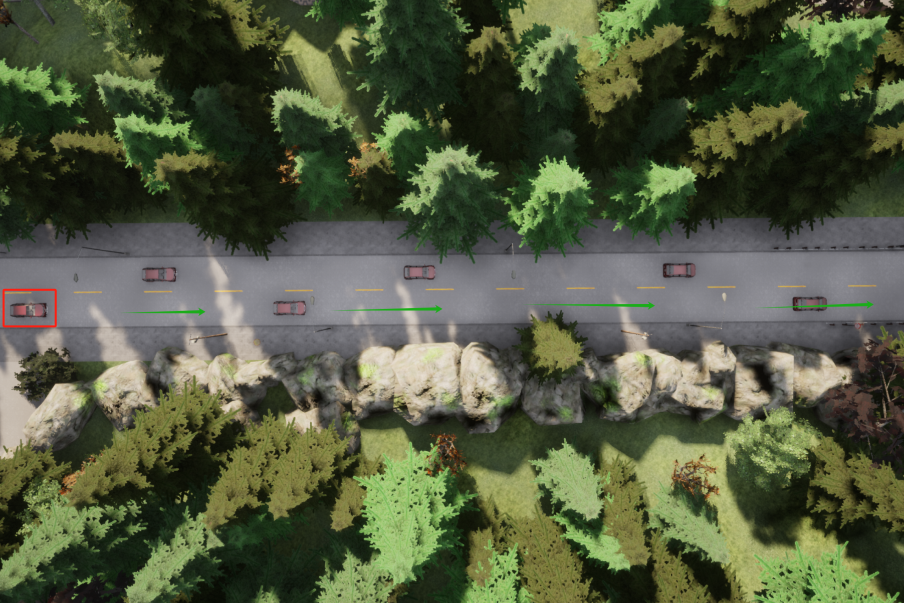
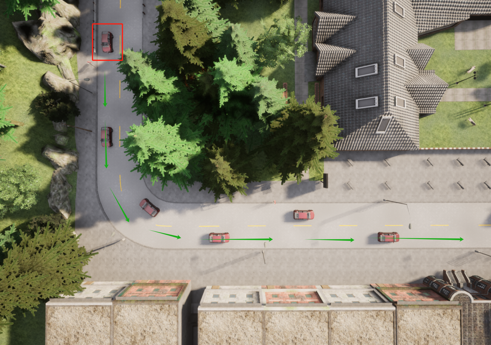

# CS7355 作业 3: 在 CARLA 中实现局部规划

本项目将向您介绍如何在自动驾驶中实施局部规划。具体来说，您将学习使用寻路算法(例如，hybrid-A*)来找到可行的路径，并使用路径平滑算法(例如样条曲线拟合)来优化路径。

## 作业要求

在本次作业中，你需要完成以下三个主要任务：

1. **调整碰撞检测器（Collision Checker）的参数**：
   - 在 `collision_checker.py` 中调整 `circle_offsets` 和 `circle_radii` 参数
   - 这些参数决定了自车的碰撞检测边界，影响避障效果
   - 此任务需要在CARLA中实现车辆的navigation和local path避障

2. **在局部路径规划器（Local Path Planner）中找到全局路线上的目标点**：
   - 在 `local_path_planner.py` 中完成 `choose_goal_cell` 函数实现
   - 调整 `offset` 参数来确定目标点距离
   - 在 `need_to_recreate_occupancy_grid` 函数中调整 `distance_threshold` 参数
   - 在 `find_lookahead_point` 函数中调整 `lookahead_len` 参数

3. **实现 Hybrid A* 算法**：
   - 在 `path_finding_algorithms.py` 中实现 `HybridAStar` 函数
   - 完成 `GenerateSuccessors` 函数以生成后继节点
   - 实现 `CalAStarPathCost` 和 `CalDubinPathCost` 函数来计算路径代价
   - 完成 `holonomic_heuristic_Astar` 函数中的A*搜索算法

### Hybrid A*算法流程

Hybrid A* 是一种结合了经典A*和连续空间搜索的算法，特别适用于车辆路径规划。算法流程如下：

1. **初始化**：
   - 创建开集（openList）和闭集（closedList）
   - 使用传统A*算法生成启发式地图
   - 将起始节点加入开集

2. **主循环**：
   - 从开集中选取f值（g + h）最小的节点作为当前节点
   - 检查当前节点是否可以直接连接到目标节点（使用Dubins曲线）
   - 如果可以连接，找到解并退出
   - 否则，生成当前节点的所有后继节点

3. **生成后继节点**：
   - 考虑车辆运动学约束（转向角限制）
   - 为每个后继节点计算g值和h值
   - 检查后继节点是否与障碍物碰撞
   - 将有效后继节点加入开集

4. **路径重建**：
   - 从目标节点回溯到起始节点
   - 添加Dubins曲线连接（如果使用）
   - 返回最终路径

## 代码结构

项目由以下几个核心文件组成，每个文件负责不同的功能模块：

1. **path_finding_algorithms.py**：
   - 实现路径规划算法，包括Hybrid A*等
   - 负责寻找从起点到目标点的可行路径
   - 包含 `Node` 类表示路径节点，`PathFindingAlgorithm` 类实现搜索算法

2. **path_finding_algorithms_evaluator**:
   - 评估路径规划算法实现是否正确

3. **collision_checker.py**：
   - 提供碰撞检测功能
   - 使用圆形模型表示车辆轮廓，检测路径点是否会导致碰撞
   - `collision_check` 函数检查给定点是否与障碍物碰撞

4. **local_path_planner.py**：
   - 局部路径规划器核心实现
   - 创建和维护占用栅格地图
   - 寻找合适的目标点并生成局部路径
   - 判断何时需要重新规划路径

5. **occupancy_grid.py**：
   - 定义占用栅格地图数据结构
   - 提供碰撞检测和地图操作功能
   - 可视化占用栅格地图

6. **math_utils.py**：
   - 提供各种数学工具函数
   - 坐标转换、距离计算、旋转变换等
   - 支持局部坐标系和全局坐标系之间的转换

7. **path_optimizer.py**：
   - 路径优化和平滑
   - 使用样条曲线拟合优化路径
   - 减少路径点并生成平滑轨迹

8. **controller.py**：
   - 实现车辆控制器
   - 根据目标位置生成控制命令

9. **map_utils.py**：
   - 提供地图相关的工具函数
   - 处理车辆生成和地图加载

10. **project3_main.py**：
   - 项目主程序入口
   - 初始化CARLA环境和车辆
   - 协调规划器和控制器的工作流程

11. **run.py**：
    - 启动脚本，执行任务

在 **path_finding_algorithms.py** 中，需要完成 `HybridAStar` 函数的实现：

```python
class PathFindingAlgorithm:
     def HybridAStar(self, start_node, goal_node, occupancy_map, search_count):
         pass
```

在 **local_path_planner.py** 中，需要完成的关键函数包括：

```python
def choose_goal_cell(self, ego_position, ego_heading, offset):
   pass
```

```python
def need_to_recreate_occupancy_grid(self, ego_position, distance_threshold):
   pass
```

```python
def find_lookahead_point(self, world, carla_map, ego_position, ego_heading, lookahead_len):
   pass
```

## 程序运作流程

项目中局部路径规划的运作流程如下：

1. **初始化阶段**：
   - 读取全局路径（global_path）
   - 初始化局部路径规划器（LocalPlanner）
   - 初始化碰撞检测器（CollisionChecker）

2. **循环规划阶段**：
   - 检查是否需要重新规划路径（need_to_recreate_occupancy_grid）：
     - 如果当前local path没有生成或者occupancy map没有创建，则需要重新规划
     - 如果自车过于靠近local path末端（距离小于设定阈值），则需要重新规划

3. **构建占用栅格地图**：
   - 基于车辆当前位置和航向构建占用栅格地图（create_occupancy_grid）
   - 将车道边界和其他车辆标记在占用栅格地图上
   - 占用栅格地图以自车为中心，使用局部坐标系

4. **目标点选择**：
   - 在全局路径上选择合适的目标点（choose_goal_cell）
   - 确保目标点在占用栅格地图范围内且远离障碍物

5. **路径规划**：
   - 使用Hybrid A*算法规划从自车到目标点的路径（HybridAStar）：
     - 计算启发式地图（holonomic_heuristic_Astar）
     - 初始化开集和闭集
     - 迭代扩展节点，生成后继节点
     - 尝试使用Dubins曲线连接到目标
     - 从搜索结果重建路径

6. **路径优化**：
   - 对规划得到的路径进行采样和平滑处理（smooth_path_spline）
   - 将平滑后的路径转换回全局坐标系

7. **路径跟踪**：
   - 选择前视点（find_lookahead_point）
   - 控制器根据前视点生成控制命令

8. **循环执行**：
   - 车辆执行控制命令，行驶一段时间
   - 返回步骤2，检查是否需要重新规划

## 任务设置

### 任务1: 路径规划算法评估

任务1主要检验您实现的路径规划算法是否正确。评估器会加载预设的占用栅格地图，然后使用您实现的Hybrid A*算法进行路径规划。如果成功规划出路径，评估器会生成两张图片，分别展示加载的占用栅格地图和规划出的路径。

在任务1中，你只需要实现**path_finding_algorithms.py**文件，不需要调整其他文件（修改**collision_checker.py**与**local_path_planner.py**文件中的参数）。同时，该任务不需要在carla仿真器下运行。

任务会读取==task1==中的地图文件（共五个文件），然后将结果输出到==task1_output==中。

以下是任务1的示例结果：


*图1: 原始占用栅格地图*


*图2: 规划路径结果*

只要能够成功规划出路径并生成可视化结果，即视为完成任务1。

### 任务2: CARLA中的车辆避障

任务2需要在CARLA仿真环境中实现车辆的导航和局部路径避障功能。

[要注意当前为了使缺失了关键代码的系统能够在carla中成功运行，车辆采用的是默认控制（即直线行驶），因此要想测试自己编写的规划算法，请将**project3_main.py**中的这段代码移除]
```python
   # 默认直线行驶
   control = carla.VehicleControl(throttle=0.5, steer=0.0, brake=0.0, hand_brake=False, reverse=False)
   ego_vehicle.apply_control(control)
   sim_world.tick()
   continue
```

您需要在完成任务1后后继续以下工作：

1. 在`collision_checker.py`中调整碰撞检测参数
2. 在`local_path_planner.py`中完成目标点选择和占用栅格更新条件

==task2==文件夹中总共有十一个测试用例。每个测试用例都配有三个文件:

- ==global_path.txt== 指定自车的全局路径
- ==vehicle.txt== 指定自车和其他车辆的初始状态
- ==map.txt== 指定仿真地图

完成任务后，评估日志文件将保存到==task2_output==文件夹

以下是任务2的任务示例：

红色框中为自车，绿色箭头为全局路径

测试用例04：

*图3: 测试用例04*

测试用例09：

*图3: 测试用例09*

*提示：*

1. 在carla中运行发现局部路径规划错误时，可以调用*OccupancyGrid*的save_test_case函数。该函数可以创建一个和任务1相同的测试用例，可以在该用例中调试检查是否是局部路径规划存在问题。
2. 发现路径规划失败时可能是以下原因：
   1. collision checker设置是否合理，是否会导致车辆过于保守，导致生成的后继点会被视为发生碰撞
   2. choose_goal_cell中选择目标点是否合理，是否和障碍物保持了足够的距离
   3. ...
3. 仿真器开始运行时黑屏是正常现象，因为后台规划器还未规划出路径

## 使用

### 交我算环境配置

1. 从==/lustre/share/class/CS7355==路径中拷贝镜像文件==project3.sif==

### PC环境配置

1. 环境配置遵从project1和project2的配置

2. 从canvas下载dubins-1.0.1.tgz并安装

   ```bash
   pip3 install dubins-1.0.1.tgz
   ```

### 运行

1. 从canvas下载==project3.zip==文件并将其解压缩到==carla==目录下

2. 移动到==carla==路径

   ```bash
   cd /home/Desktop/carla
   ```

3. 然后运行脚本

   ```bash
   # 运行任务1某个任务（比如任务0）
   python3 ./project3/path_finding_algorithms_evaluator.py --task-index 0
   
   # 运行任务1全部任务
   python3 ./project3/path_finding_algorithms_evaluator.py
   
   # 运行任务2某个任务（比如任务0）
   python3 ./project3/run.py --task-index 0
   
   # 运行任务2全部任务
   python3 ./project3/run.py
   
   # 运行评分脚本查看任务2分数
   python3 score.py
   ```

## 作业提交

提交文件需要包括

- 评估文件: ==task1_output== ==task2_output==文件夹
- 可运行的代码: ==project3==文件夹

请将上述两个文件夹打包成zip文件并命名为==学号_姓名.zip==（例如，==张三_XXXXXXXXX.zip==），提交到 Canvas。

## 评分

### 任务1：
只要能够成功规划出路径并生成可视化结果，即视为完成任务1。

### 任务2：
规划器的性能将通过==归一化反路径长度==(success weighted by normalized inverse Path Length，SPL) 进行评估，其计算公式为
$$
\frac{1}{N}\sum_{i=1}^{N}S_i\frac{\ell_{i}}{\max(p_i, \ell_{i})},
$$
其中，$N$为场景个数，$\ell$ 为最短路径长度（默认为给定全局路径长度），$p$为车辆实际轨迹长度，$S$是一个二元值显示任务是否成功（0：失败；1：成功，碰撞，未到达终点都会视为失败）

:warning: 严禁手动修改日志文件。我们将随机测试代码，模拟结果与日志文件之间的不一致(略微误差忽略不计)将导致零分。


## 截止日期
作业截止日期为11:59pm, 5/12, 2025

